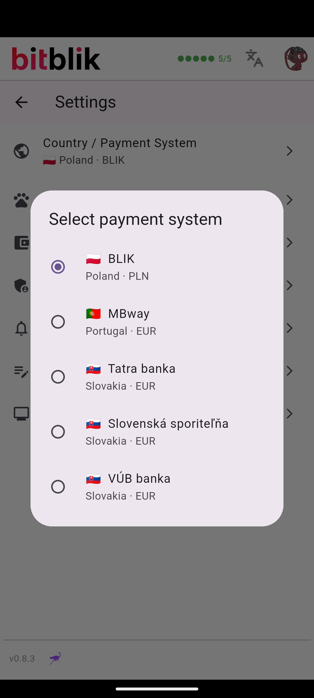
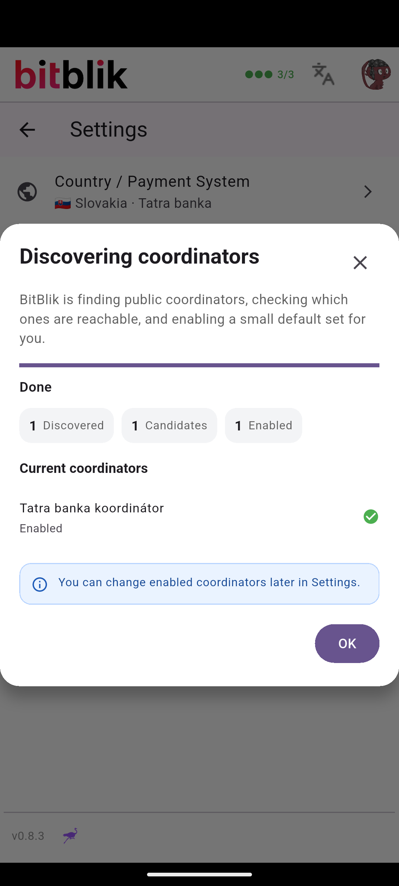
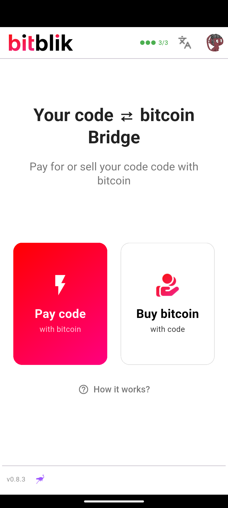
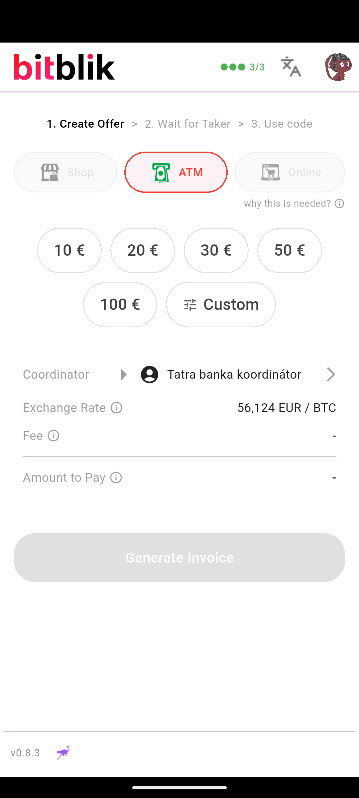
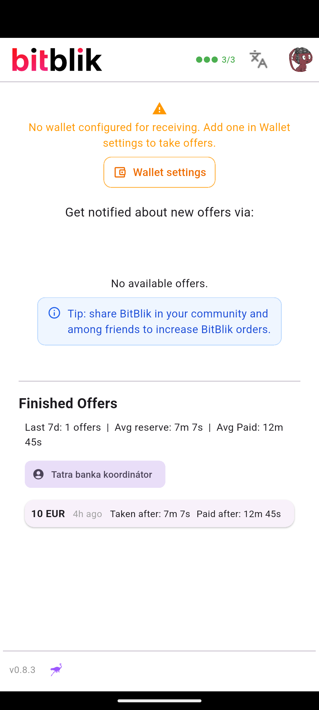

# BitBlik SK — Návody / Manuals

Bilingválne návody (EN + SK) pre kúpu a predaj Lightningu za hotovosť cez
bezkartový výber z bankomatu troch slovenských bánk.

## Manuals / Návody
| # | Bank | Flow | File |
|---|------|------|------|
| 1 | Tatra banka | **Sell** LN for cash at ATM | [tatra-sell.md](tatra-sell.md) |
| 2 | VÚB banka | **Sell** LN for cash at ATM | [vub-sell.md](vub-sell.md) |
| 3 | Slovenská sporiteľňa | **Sell** LN for cash at ATM | [slsp-sell.md](slsp-sell.md) |
| 4 | Tatra banka | **Buy** LN (generate code) | [tatra-buy.md](tatra-buy.md) |
| 5 | VÚB banka | **Buy** LN (generate code) | [vub-buy.md](vub-buy.md) |
| 6 | Slovenská sporiteľňa | **Buy** LN (generate code) | [slsp-buy.md](slsp-buy.md) |

---

## EN — How BitBlik SK works (the two roles)

BitBlik lets two strangers swap **Bitcoin Lightning** for **cash at an ATM** using
a bank's **cardless withdrawal** feature. No card is inserted at the ATM — a
short **6-digit code** is the only credential.

- **Buyer** = account holder. Generates a cardless-withdrawal code in their bank
  app and submits it in BitBlik. Their account is debited when the seller
  collects the cash; in return they receive Lightning. → **"Buy" manuals**.
- **Seller** = the one who walks to the ATM and types the code to get cash. They
  lock Lightning in BitBlik and receive the cash. → **"Sell" manuals**.

The two must be online **at the same time** and the seller must be **at the
bank's ATM** while the code is valid (Tatra 20 min · SLSP 15 min · **VÚB only 3
min**).

## SK — Ako BitBlik SK funguje (dve roly)

BitBlik umožňuje dvom ľuďom vymeniť **Bitcoin Lightning** za **hotovosť z
bankomatu** cez funkciu **výberu bez karty**. Pri bankomate sa nevkladá karta —
jediné, čo treba, je **6-miestny kód**.

- **Kupujúci** = majiteľ účtu. V mobilnej appke banky vygeneruje kód na výber bez
  karty a zadá ho v BitBliku. Z jeho účtu sa peniaze odpíšu, keď predávajúci
  vyberie hotovosť; za to dostane Lightning. → **návody „Buy"**.
- **Predávajúci** = ten, kto ide k bankomatu a zadá kód, aby dostal hotovosť. V
  BitBliku zamkne Lightning a dostane hotovosť. → **návody „Sell"**.

Obaja musia byť online **naraz** a predávajúci musí byť **pri bankomate banky**,
kým je kód platný (Tatra 20 min · SLSP 15 min · **VÚB len 3 min**).

---

## App screens / Obrazovky appky (real captures)

Captured from the SK release APK. The BitBlik flow is **identical for all three
banks** — only the bank name differs — so these Tatra screens are representative
for SLSP and VÚB too.

| Krok / Step | |
|---|---|
| Select your bank: on **first launch** the app shows a **market picker** (Tatra banka / Slovenská sporiteľňa / VÚB banka); change it anytime in **Settings → Country / Payment System** |  |
| Coordinator auto-discovered & enabled (proof the market is live) |  |
| Home / role selection (Pay code · Buy bitcoin) |  |
| **Sell** flow — Create Offer → **ATM** → € amount → Tatra koordinátor |  |
| **Buy** flow — offer list (needs a receiving wallet) |  |

## ⚠️ Important / Dôležité upozornenie

**EN:** The banks' cardless-withdrawal service is designed for the account
holder's **own** cash. Using it to hand money to another person may breach the
**bank's terms of service**, and above a threshold may conflict with laws on
cashless transfers. Tatra banka states this explicitly. Use BitBlik SK at your
own risk and seek legal advice before operating at scale.

**SK:** Bezkartový výber je určený na výber **vlastnej** hotovosti majiteľa účtu.
Použitie na odovzdanie peňazí inej osobe môže porušovať **obchodné podmienky
banky** a nad určitú sumu aj zákon o bezhotovostných prevodoch. Tatra banka to
uvádza výslovne. BitBlik SK používate na vlastné riziko; pri väčšom rozsahu
konzultujte s právnikom.

> 📸 App screenshots marked `[APP: …]` are to be captured from the BitBlik SK
> release APK (`app-bitblik-release.apk`). Bank screenshots link to official /
> press sources (verified).
